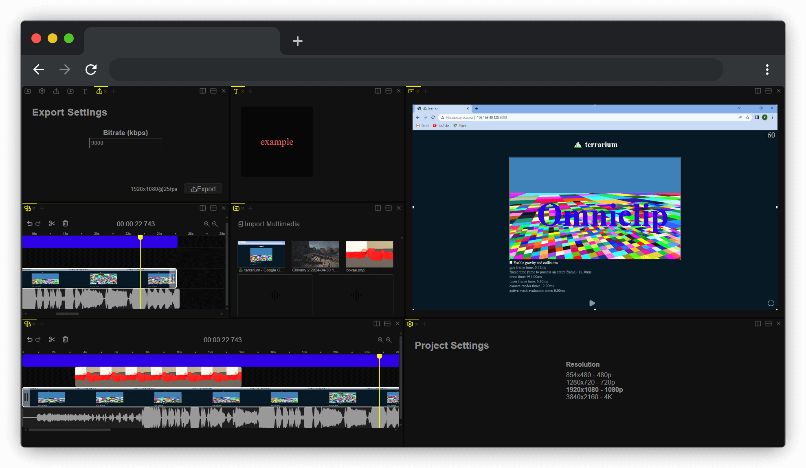
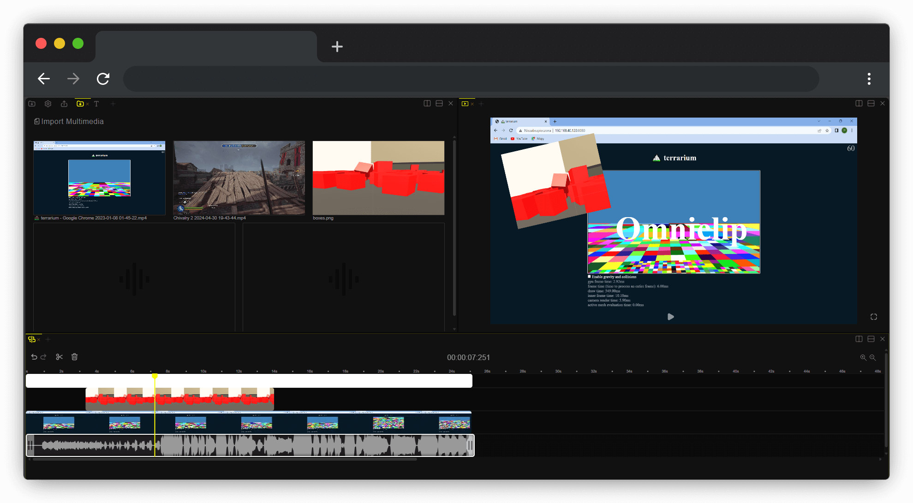

<p align="center"></p>
<p align="center"><a href="https://opensource.org/license/mit"></a></a></p>
<p align="center">Open source video editing web application</p>

## Introduction
If you are tired of paying to use all the features of existing video editing applications then you might have found a gem! Turns out omniclip is fully free and on top of that its open source.
Everything works inside browser, theres no private data being used, everything is kept within your device disk space.

## Features
  Note that it is quite basic video editor, but it is my main project and I will keep working on it and improving.
  It utilizes webcodecs API, it means that the rendering process is fastest it can be on web browsers.
- Trimming
- Splitting
- Supports - Text, Audio, Video (mp4 & MOV) and Images
- Clip editing on preview - rotating, resizing, text styling and more
- Undo/Redo
- Render in different resolutions, aspect ratios, framerates, up to 4k.
- Transitions - Applying transitions between video clips for smooth visual effects
- Filters
- Project manager - manage multiple projects, persisted in localstorage
- Collaboration - work with other people on same project in real time
- Export and import project
## To be added
- Better transitions - more customizable transitions (glsl shaders)
- Audio Editing - Adjusting volume etc
- Keyframes
- Auto-Captions
- Effects
- Masking

## How to
  #### Use omniclip components in your app:
  1. Install omniclip:  
  ```sh
  npm install omniclip
  ```
  2. Import components and register them to the dom
  ```js
  import {getComponents, registerElements} from 'omniclip'
  registerElements(getComponents())
  ```
  3. Simply put the components you would like to use, or all components for whole experience:
  ```html
  <omni-text></omni-text>
  <omni-media></omni-media>
  <omni-timeline></omni-timeline>
  ```
  #### Use omniclip tools:
  // no tools yet, but will be added here: https://github.com/omni-media/omnitool

## Demo

Demo Page - https://omniclip.app/
<p style="display: flex; flex-direction: row;" align="center">
   
</p>


## Contributing
Contributing is vital part of this project, so feel free to help and build this awesome video editor together, simply choose the issue you feel like working on and if you are done make a pull request.
to ease communiaction, its best to join my discord server: https://discord.gg/Nr8t9s5wSM
#### Development:
To start contirbuting you need to do those steps first:
1. Clone the repository: `git clone git@github.com:omni-media/omniclip.git` or fork it
2. Install the dependencies: `npm install`
3. Build the project: `npm run build`
4. Start developing!: `npm start`

#### Project architecture
This project leverages the following key components for managing application state:
  1. State
  2. Actions
  3. Controllers
  4. Components/Views

The architecture follows a unidirectional data flow model, where data flows in a single direction from actions to state and from state to components.

#### Tech Stack
- Typescript
- @benev/slate

### Contact/Sponsorship
If you are willing to help this project by sponsoring it or have some other questions:
- discord: zenkyu
- gmail: przemekgg2002@gmail.com

## License

This project is licensed under the MIT License - see the [LICENSE](LICENSE) file for details.


